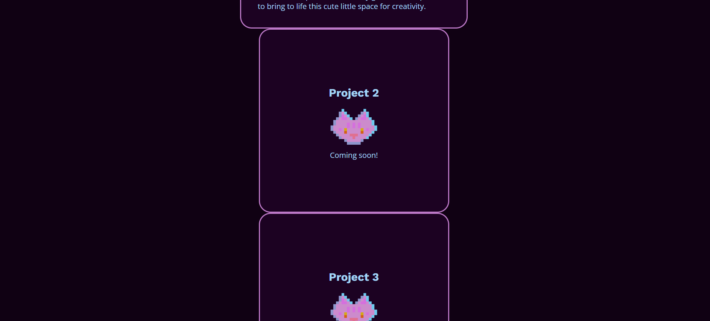
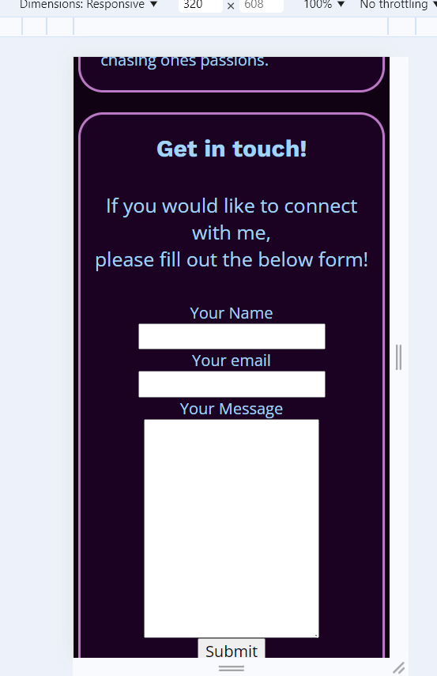
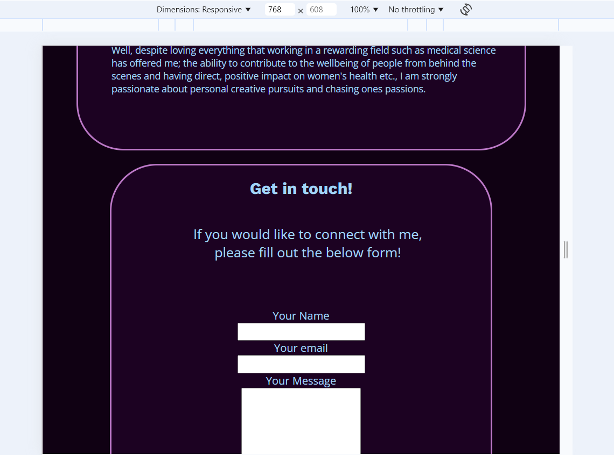
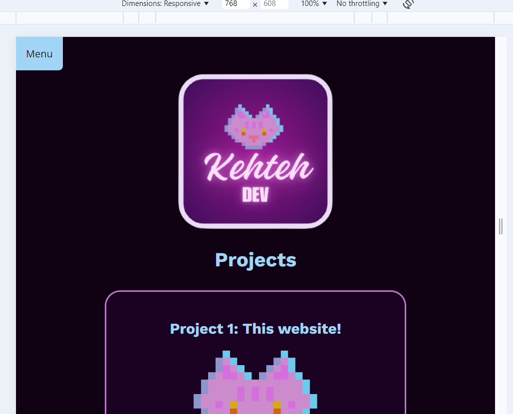

#  Katie Connell - Portfolio Task
​
[My portfolio](kehteh.github.io)
​
## Project Requirements

### Content
 Add a short paragraph describing the features below. What aesthetic and technical choices did you make? 
- [X] At least one profile picture
- [X] Biography (at least 100 words)
- [X] Functional Contact Form
- [X] "Projects" section
- [X] Links to external sites, e.g. GitHub and LinkedIn.

I went with an oil slick/vapour wave colour palette. I wanted to explore the cozy game realm so I added my own pixel art cat "Dumpling" that I would like to explore as a potential mascot for my personal branding. I included my original headshot that I applied to She Codes with, and used border-radius to crop it into a circle for aesthetic purposes. My biography proved to be the most difficult section on the page because it is quite long and having the lines flow in a reader-friendly manner was quite the task! My contact form is now functional and connected to Fromspree, with many friends testing it out to send me messages in their down time. My projects section is within it's own page connected via link to the main index page. It is a work progress as this of course is my first project. I've made space for 3 projects. At the foot of each of my pages I have included a footer with functioning links that open up in separate tabs for instagram, linked in and github these all are attached to my developing accounts on these sites. I have also made sure to include a copyright declaration.  
​
### Technical
 Add a short paragraph describing the features below. What strategies or design decisions did you work from? 
- [X] At least 2 web pages.
- [X] Version controlled with Git
- [X] Deployed on GitHub pages.
- [X] Implements responsive design principles.
- [X] Uses semantic HTML.

My two web pages are my main index or "My profile" and my projects page or "Projects" are connected via a JavaScript menu I added to my website. With every major change I was consistently saving via VS code then git adding, committing, merging then pushing content on to GitHub. My website is currently deployed on GitHub pages. At the end of both of my style sheets I have added media queries that are responsive to most, if not all common screen sizes. I have also checked all colour combos that involve text and used clear fonts to maintain accessibility. I have used semantics to the best of my ability to make sure my HTML is logical, easy to read and clean.

### Bonus (optional)
 Add a short paragraph describing the features below, if you included any. 
- [?] Different styles for active, hover and focus states.
- [X] Include JavaScript to add some dynamic elements to your site. (Extra tricky!)

In my search for the ideal nav menu I came across a JavaScript menu that I decided to attempt to use. When you click on it, it toggles the drop down menu and the menu button changes colour. I was able to personalise the colours to my liking making sure that the colours remained accessible.
​
### Screenshots
> Please include the following:
> - The different pages and features of your website on mobile, tablet and desktop screen sizes (multiple screenshots per page and screen size).
> - The different features of your site, e.g. if you have hover states, take a screenshot that shows that.  
> 
> You can do this by saving the images in a folder in your repo, and including them in your readme document with the following Markdown code: 

####  desktop index part 1 

####  desktop index part 2

####  desktop index part 3 
![A picture of Katies biography with a cicular cropped image of a woman in a pink blaser and bubble o bill earrings. The bio says: "I am an aspiring web developer learning to code alongside 23 talented and inspiring women in the 2024/2025 She Codes Plus cohort. In previous years (or perhaps previous lives) I studied Classical Performance on flute at the Western Australian Academy of Performing Arts, from which I went on to teach as a tutor. I then moved on to medical science wherein I worked as a scientist in histology and settled into my current specialty: cytology. ..and yet, here I am, learning to code.vCurious, very curious indeed. Well, despite loving everything that working in a rewarding field such as medical science has offered me; the ability to contribute to the wellbeing of people from behind the scenes and having direct, positive impact on women's health etc., I am strongly passionate about personal creative pursuits and chasing ones passions." Background consists of dark purples with highlights of cyan and lilac. Text is cyan.](./project1pics/desk3index.png)

####  desktop index part 4 

####  desktop projects part 5 

####  desktop projects part 6 

####  desktop projects part 7

####  desktop projects part 8

####  mobile index part 1

####  mobile index part 2

####  mobile index part 3

####  mobile index part 4
![A picture of Katies biography. It says: "I am an aspiring web developer learning to code alongside 23 talented and inspiring women in the 2024/2025 She Codes Plus cohort. In previous years (or perhaps previous lives) I studied Classical Performance on flute at the Western Australian Academy of Performing Arts, from which I went on to teach as a tutor. I then moved on to medical science wherein I worked as a scientist in histology and settled into my current specialty: cytology. ..and yet, here I am, learning to code.vCurious, very curious indeed. Well, despite loving everything that working in a rewarding field such as medical science has offered me; the ability to contribute to the wellbeing of people from behind the scenes and having direct, positive impact on women's health etc., I am strongly passionate about personal creative pursuits and chasing ones passions." Background consists of dark purples with highlights of cyan and lilac. Text is cyan.](./project1pics/mob4index.png)

####  mobile index part 5

####  mobile index part 6

####  mobile projects part 7

####  mobile projects part 8

####  mobile projects part 9

####  mobile projects part 10

####  mobile projects part 11

####  tablet index part 1

####  tablet index part 2

####  tablet index part 3

####  tablet index part 4
![A picture of Katies biography. It says: "I am an aspiring web developer learning to code alongside 23 talented and inspiring women in the 2024/2025 She Codes Plus cohort. In previous years (or perhaps previous lives) I studied Classical Performance on flute at the Western Australian Academy of Performing Arts, from which I went on to teach as a tutor. I then moved on to medical science wherein I worked as a scientist in histology and settled into my current specialty: cytology. ..and yet, here I am, learning to code.vCurious, very curious indeed. Well, despite loving everything that working in a rewarding field such as medical science has offered me; the ability to contribute to the wellbeing of people from behind the scenes and having direct, positive impact on women's health etc., I am strongly passionate about personal creative pursuits and chasing ones passions." Background consists of dark purples with highlights of cyan and lilac. Text is cyan.](./project1pics/tablet4index.png)

####  tablet index part 5

####  tablet index part 6

####  tablet index part 7

####  tablet projects part 8

####  tablet projects part 9

####  tablet projects part 10

####  tablet projects part 11

####  tablet projects part 12

####  JavaScript Menu 1 before mouse hover 

####  JavaScript Menu 2 during mouse hover 

####  JavaScript Menu 3 after mouse toggle 

